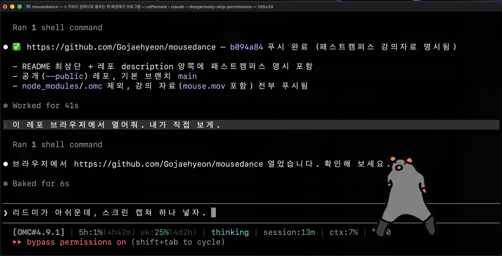

# 🐭 Mousedance

> 📚 본 프로젝트는 패스트캠퍼스(FastCampus) 강의 자료입니다.

그린스크린 쥐가 바탕화면에 둥둥 떠서 춤추고, **맥 어디서든 타자를 칠수록 더 빨리 춤추는** macOS 데스크톱 펫.



- 영상의 초록 배경을 **실시간 크로마키**로 제거 (누끼 자동) — 별도 변환 불필요
- **맥 전체** 키 입력을 감지해서 타자가 빠를수록 재생 속도 ↑ (가만히 있어도 기본 속도로 계속 춤춤)
- 쥐를 **마우스로 잡아서** 원하는 곳에 옮길 수 있음 (쥐 바깥 투명 영역은 클릭이 뒤 앱으로 통과)

## 실행

```bash
npm install      # 최초 1회
npm start
```

## 영상 넣기

프로젝트 폴더에 그린스크린 영상을 아래 이름 중 하나로 넣으세요 (확장자 포함):

```
mouse.mp4   mouse.mov   mouse.webm   mouse.m4v
```

> 지금은 테스트용 더미 `mouse.mp4`(초록 위 흰 공)가 들어있습니다. **실제 쥐 영상으로 교체**하면 됩니다.
> H.264(mp4/mov) 또는 VP8/9(webm) 코덱을 권장합니다.

## ⚠️ macOS 권한 (타자 감지에 필수)

맥 전체 키 입력을 읽으려면 **손쉬운 사용(Accessibility)** 권한이 필요합니다.
처음 실행하면 macOS가 권한을 요청하거나, 안 되면 수동으로:

**시스템 설정 → 개인정보 보호 및 보안 → 손쉬운 사용** 에서
실행한 앱(개발 중엔 **터미널** 또는 **Electron**)을 켜주세요. 권한을 준 뒤 앱을 재시작.

권한이 없으면 쥐는 기본 속도로 춤만 추고, 타자에는 반응하지 않습니다.

## 조작

| 동작 | 방법 |
|------|------|
| 쥐 옮기기 | 쥐를 마우스로 드래그 |
| 가운데로 데려오기 | 메뉴막대 🐭 아이콘 → "가운데로" |
| 종료 | `⌘⇧M` 또는 메뉴막대 🐭 → 종료 |

## 튜닝

`renderer.js` 상단 `CONFIG`:

| 값 | 의미 |
|----|------|
| `keySimilarity` / `keySmooth` | 초록 제거 강도 / 가장자리 부드러움 (초록 테두리가 남으면 ↑) |
| `despill` | 가장자리 초록 번짐 제거 |
| `idleRate` / `maxRate` | 기본 / 최고 춤 속도 |
| `keysForMax` | 최고 속도에 도달하는 데 필요한 최근 타자 수 |
| `decayPerSec` | 타자 멈춘 뒤 속도 줄어드는 빠르기 |

## 구조

- `main.js` — 투명·최상단 창, 전역 키보드 훅, 드래그·클릭통과 IPC, 트레이
- `preload.js` — 안전한 IPC 브리지
- `index.html` / `renderer.js` — WebGL 크로마키 렌더 + 타자→속도 로직
